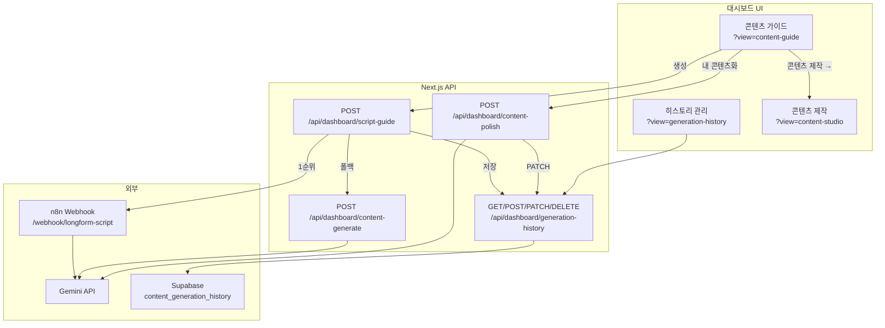

# 콘텐츠 생성 파이프라인 — 복구·이전 가이드

> **목적:** n8n 장애, PC 이전, 새 Agent 세션에서도 이 문서만으로 콘텐츠 생성 흐름을 **그대로 복구**할 수 있도록 작성했습니다.  
> **작성 기준일:** 2026-05-30  
> **프로젝트 루트:** `dashboard-app/`

---

## 1. 한 줄 요약

```
발행 주제 입력(필수) → (선택) 레퍼런스 → 스크립트 가이드 생성 → Supabase에 원본 저장
→ (선택) 내 콘텐츠화 → Supabase에 정재본 추가 → 히스토리 관리 / 콘텐츠 제작
```

**AI 생성:** n8n `longform-script` Webhook(Gemini) **1순위** → 실패 시 대시보드 `content-generate`(Gemini) **폴백**  
**영구 저장:** Supabase `content_generation_history` (원본 `draft` + 정재 `polished`)

---

## 2. 아키텍처



---

## 3. 사이드바 메뉴 · URL

| 메뉴 | view 파라미터 | 역할 |
|------|---------------|------|
| 콘텐츠 가이드 | `content-guide` | 주제 입력, 레퍼런스, 생성, 내 콘텐츠화 |
| 콘텐츠 제작 | `content-studio` | 발행용 초안 편집·저장 (localStorage) |
| 히스토리 관리 | `generation-history` | Supabase 저장분 검색·원본/정재 확인 |

**예:** `http://localhost:3000/dashboard?view=content-guide`

---

## 4. 사용자 워크플로 (상세)

### 4.1 1단계 — 발행 주제 입력 (필수)

- **화면:** 콘텐츠 가이드 **맨 위** `✍️ 발행하고 싶은 주제 · 키워드`
- **예:** `삼성전자 단기 전망`, `하이닉스 1주일 전망`
- **구분:** 쉼표·줄바꿈·`·` 로 여러 키워드
- **저장:** 브라우저 `localStorage` 키 `guide-publish-topic-v1`
- **URL:** `?topic=...` 로 AI 인사이트 → 가이드 이동 시 자동 채움

**주제 결정 우선순위 (코드):**

1. `userTopic` (사용자 입력) — **최우선**
2. 파싱된 keywords
3. 레퍼런스 제목 (사용자 주제 없을 때만)

→ 파일: `lib/dashboard/script-guide-output.ts` → `deriveTopic()`

### 4.2 2단계 — 참고 레퍼런스 (선택)

- 급상승 RSS · RSS 주제 · 기획 큐 · 채널 콘텐츠 피커
- **역할:** 제목·H2 구조·톤만 벤치마킹 (문장 복사·주제 변경 금지)
- **저장:** `localStorage` 키 `dashboard_guide_references`
- **0개여도 생성 가능**

### 4.3 3단계 — 포맷 선택

| 가이드 탭 | category | targetFormat | platform |
|-----------|----------|--------------|----------|
| 글쓰기 | `writing` | `blog` | `naver-blog` |
| 이미지 | `image` | `carousel` | `instagram` |
| 영상 | `video` | `longform` | `youtube` |

### 4.4 4단계 — 스크립트 가이드 생성

- 버튼: `✨ 스크립트 가이드 생성`
- API: `POST /api/dashboard/script-guide`
- **성공 시:**
  - 화면 «생성 결과»에 표시
  - Supabase `content_generation_history`에 **원본(draft)** INSERT
  - 토스트: `Supabase에 저장` (실패 시 `히스토리 저장 실패` 경고 — 생성 자체는 성공할 수 있음)

**요청 body 예시:**

```json
{
  "context": {
    "category": "writing",
    "userTopic": "삼성전자 단기 전망",
    "keywords": ["삼성전자 단기 전망"],
    "referenceTitles": ["레퍼런스 제목1"],
    "references": [{ "title": "...", "platform": "naver-blog" }],
    "intent": "blog"
  }
}
```

**응답 (ScriptGuideOutput) 주요 필드:**

| 필드 | 설명 |
|------|------|
| `mode` | `n8n` 또는 `dashboard` (폴백) |
| `title` | 생성 제목 |
| `fullScript` | **원본 전체 본문 (마크다운)** |
| `hook`, `cta`, `chapterSummary` | 메타 |
| `topic` | 확정 주제 |

### 4.5 5단계 — 내 콘텐츠화 (선택)

- 버튼: `✨ 내 콘텐츠화`
- API: `POST /api/dashboard/content-polish`
- **역할:**
  - 레퍼런스·채널명·벤치마킹 표현 **제거**
  - 발행용 톤으로 정재
  - **블로그:** 환기용 **이미지·표 가이드 텍스트 블록** 삽입 (실제 이미지 생성 **없음**)
- **성공 시:** Supabase 동일 행의 `polished` JSONB UPDATE

### 4.6 6단계 — 콘텐츠 제작으로 이동

- 버튼: `콘텐츠 제작 →`
- `localStorage` 키 `content-studio-import-v1` 에 title/body/notes 저장 후 `?view=content-studio` 이동
- ContentStudioView 마운트 시 `consumeContentStudioImport()` 로 1회 로드

### 4.7 7단계 — 히스토리 관리

- `?view=generation-history`
- Supabase 전체 조회, 검색·필터
- 항목 펼치기 → **기본 탭: 원본 (가이드 초안)** → `내 콘텐츠화` 탭 전환
- 뱃지: `원본 3,239자` / `내 콘텐츠화 4,963자`

---

## 5. 블로그 이미지 — 어떻게 추가하는가 (핵심)

> **중요:** 이 시스템은 **이미지 파일을 자동 생성하지 않습니다.**  
> «내 콘텐츠화» 단계에서 Gemini가 본문 **중간에 텍스트 가이드 블록**을 넣어, **직접 제작·삽입**할 위치와 내용을 안내합니다.

### 5.1 이미지 가이드가 생성되는 조건

- `category === 'writing'` 또는 `targetFormat === 'blog'`
- `lib/dashboard/content-polish.ts` → `suggestImageGuideCount()`
  - 본문 문단 수 추정 → 약 **3~4문단당 1장** (최소 1, 최대 5)

### 5.2 본문에 삽입되는 가이드 블록 형식

```markdown
> **📷 [환기용 이미지 가이드 1/3 — 직접 제작·삽입]**
> - **삽입 위치:** (어느 H2·문단 직후인지)
> - **이미지 유형:** (일러스트 / 인포그래픽 / 스크린샷 / 다이어그램 / 표 등)
> - **화면 구성:** (주요 오브젝트·색감·텍스트 오버레이)
> - **전달 메시지:** (이 구간 독자가 얻어야 할 한 줄)
> - **캡션 예시:** (20자 내외)
```

**표 가이드** (1~2곳, 이미지 대신 가능):

```markdown
> **📊 [표 가이드 — 직접 제작·삽입]**
> - **삽입 위치:** ...
> - **표 제목:** ...
> - **열 구성:** ...
> - **행 예시:** ...
```

### 5.3 발행까지 실무 순서 (네이버·티스토리)

1. **히스토리 관리** 또는 가이드에서 **«내 콘텐츠화»** 본문 복사
2. 본문을 훑으며 `📷 [환기용 이미지 가이드` 블록 찾기
3. 각 가이드에 따라:
   - **Canva / Figma / PPT** 등으로 이미지 제작  
   - 또는 **스크린샷·차트·표** 캡처
4. 에디터에서 가이드 블록 **직전 또는 직후**에 이미지 업로드
5. 가이드 블록은 **발행 전 삭제**하거나, 메모용으로만 남김 (권장: 삭제)
6. `캡션 예시`를 이미지 alt·캡션에 반영
7. 콘텐츠 제작 화면에서 최종 교정 후 발행

### 5.4 이미지가 없는 경우

- «내 콘텐츠화»를 건너뛰면 **가이드 블록 없음** → 순수 텍스트 초안만 저장
- 블로그 탭(writing) + 내 콘텐츠화 실행 시에만 가이드 삽입

---

## 6. Supabase — 히스토리 스키마

**마이그레이션:** `docs/migrations/11-content-generation-history.sql`

```sql
CREATE TABLE IF NOT EXISTS content_generation_history (
  id                TEXT PRIMARY KEY,
  publish_topic     TEXT NOT NULL DEFAULT '',
  category          TEXT NOT NULL DEFAULT 'writing',
  reference_count   INTEGER NOT NULL DEFAULT 0,
  reference_titles  JSONB NOT NULL DEFAULT '[]'::jsonb,
  draft             JSONB NOT NULL,   -- 원본 (가이드 초안)
  polished          JSONB,            -- 내 콘텐츠화 (nullable)
  created_at        TIMESTAMPTZ NOT NULL DEFAULT NOW(),
  updated_at        TIMESTAMPTZ NOT NULL DEFAULT NOW()
);
```

### draft JSON 구조

```json
{
  "title": "블로그 제목",
  "fullScript": "# 제목\n\n## H2\n본문...",
  "hook": "오프닝",
  "cta": "마무리 CTA",
  "chapterSummary": ["H2-1", "H2-2"],
  "seoKeywords": ["키워드1"],
  "mode": "n8n",
  "targetFormat": "blog",
  "platform": "naver-blog",
  "topic": "발행 주제",
  "generatedAt": "2026-05-30T12:00:00.000Z"
}
```

### polished JSON 구조

```json
{
  "title": "발행용 제목",
  "fullContent": "마크다운 (이미지 가이드 블록 포함)",
  "summary": "정재 요약",
  "imageGuideCount": 3,
  "polishedAt": "2026-05-30T12:05:00.000Z"
}
```

**보관:** 최대 30건, 초과 시 `updated_at` 오래된 항목 자동 삭제

---

## 7. API 레퍼런스

### 7.1 POST `/api/dashboard/script-guide`

생성 파이프라인 진입점.

### 7.2 POST `/api/dashboard/content-generate`

n8n 폴백. `GEMINI_API_KEY` 필수. `suppressAutoContext: true` 시 트렌드 자동 주입 안 함.

### 7.3 POST `/api/dashboard/content-polish`

내 콘텐츠화. body: `{ title, fullScript, category, targetFormat, userTopic?, referenceTitles? }`

### 7.4 `/api/dashboard/generation-history`

| Method | 용도 |
|--------|------|
| GET | 목록 `{ items: [...] }` |
| POST | 원본 저장 `{ result, publishTopic, category, referenceTitles }` |
| POST `{ action: "migrate", items }` | localStorage 1회 이전 |
| PATCH | `{ id, polished }` 정재본 연결 |
| DELETE `?id=` | 단건 삭제 |
| DELETE `?all=1` | 전체 삭제 |

---

## 8. n8n 설정 · 복구

### 8.1 필수 환경변수 (`.env.local`)

```bash
# Supabase
NEXT_PUBLIC_SUPABASE_URL=https://xxx.supabase.co
NEXT_PUBLIC_SUPABASE_ANON_KEY=...
SUPABASE_SERVICE_ROLE_KEY=...

# Gemini (대시보드 + n8n 공통)
GEMINI_API_KEY=...

# n8n Webhook (로컬 기본)
N8N_WEBHOOK_LONGFORM_SCRIPT=http://localhost:5678/webhook/longform-script

# n8n → 대시보드 API (워크플로 내부 호출)
DASHBOARD_API_URL=http://host.docker.internal:3000
```

> ⚠️ **보안:** API 키는 Git에 커밋하지 말 것. PC 이전 시 `.env.local` 수동 복사.

### 8.2 n8n 기동

```bash
cd dashboard-app
docker volume create n8n_data   # 최초 1회
docker compose -f docker-compose.n8n.yml --env-file .env.local up -d
./scripts/n8n-setup.sh          # 워크플로 import + activate
```

**롱폼 스크립트 워크플로 파일:**  
`docs/n8n/workflows/N8N_LONGFORM_SCRIPT.json` (W08)

**프롬프트 핵심 규칙 (2026-05-30 기준):**

- `주제(필수)` = 사용자 입력 — **최우선**
- 레퍼런스 = 선택, 구조·톤만 참고
- 레퍼런스 없으면 주제+키워드만으로 작성

### 8.3 n8n 장애 시 (폴백)

1. `script-guide` API가 n8n 실패를 감지
2. 자동으로 `content-generate` (Gemini 직접) 호출
3. 응답 `mode: "dashboard"` — **기능 동일, n8n 불필요**
4. **필수:** `GEMINI_API_KEY` + `npm run dev` 재시작

**검증 스크립트:**

```bash
./scripts/verify-script-guide.sh
```

### 8.4 n8n 완전 재설치 (PC 이전)

```bash
cd dashboard-app
docker compose -f docker-compose.n8n.yml --env-file .env.local down
docker volume rm n8n_data          # ⚠️ n8n 내부 설정 초기화
docker volume create n8n_data
docker compose -f docker-compose.n8n.yml --env-file .env.local up -d
./scripts/n8n-setup.sh
```

Supabase 히스토리는 **n8n과 무관** — PC 바꿔도 유지.

---

## 9. PC 이전 · 새 환경 체크리스트

### 9.1 복사할 것

- [ ] `dashboard-app/` 전체 (또는 git clone)
- [ ] `.env.local` (수동, Git 제외)
- [ ] Supabase 프로젝트 URL/키 (동일 프로젝트면 히스토리 유지)

### 9.2 설치 · 기동

```bash
cd dashboard-app
npm install
# Supabase 마이그레이션 미적용 시 SQL Editor에서 11-content-generation-history.sql 실행
npm run dev
# 별도 터미널
docker compose -f docker-compose.n8n.yml --env-file .env.local up -d
./scripts/n8n-setup.sh
```

### 9.3 동작 확인

1. 로그인 → `?view=content-guide`
2. 발행 주제 입력 → 생성 → 토스트 `Supabase에 저장`
3. `?view=generation-history` → 원본 N자 뱃지 확인
4. `./scripts/verify-script-guide.sh`

---

## 10. localStorage 키 (브라우저 로컬)

| 키 | 용도 | Supabase 대체 |
|----|------|----------------|
| `guide-publish-topic-v1` | 발행 주제 | ❌ 로컬만 |
| `dashboard_guide_references` | 레퍼런스 | ❌ 로컬만 |
| `planning-queue-v1` | 기획 큐 | ❌ 로컬만 |
| `content-studio-import-v1` | 제작 화면 임포트 (1회) | ❌ 로컬만 |
| `content-generation-history-v1` | (구) 히스토리 | ✅ Supabase로 이전됨 |

**PC·브라우저 변경 시:** 히스토리는 Supabase에 있으므로 **히스토리 관리**만 보면 됨.  
레퍼런스·기획 큐는 로컬이라 **재설정 필요**.

---

## 11. 핵심 소스 파일 맵

| 경로 | 역할 |
|------|------|
| `components/dashboard/views/ContentCreationGuideView.tsx` | 가이드 UI·생성·정재 |
| `components/dashboard/views/GenerationHistoryView.tsx` | 히스토리 전용 화면 |
| `components/dashboard/GenerationHistoryList.tsx` | 원본/정재 목록 UI |
| `app/api/dashboard/script-guide/route.ts` | 생성 API (n8n → 폴백) |
| `app/api/dashboard/content-generate/route.ts` | Gemini 직접 생성 |
| `app/api/dashboard/content-polish/route.ts` | 내 콘텐츠화 |
| `app/api/dashboard/generation-history/route.ts` | 히스토리 CRUD |
| `lib/data/generation-history-queries.ts` | Supabase 쿼리 |
| `lib/dashboard/content-polish.ts` | 정재 프롬프트·**이미지 가이드** |
| `lib/dashboard/script-guide-output.ts` | topic·마크다운 변환 |
| `lib/dashboard/generation-history-types.ts` | draft/polished 타입 |
| `lib/hooks/use-generation-history.ts` | 프론트 히스토리 훅 |
| `docs/n8n/workflows/N8N_LONGFORM_SCRIPT.json` | n8n W08 워크플로 |
| `scripts/n8n-setup.sh` | n8n import/activate |
| `scripts/verify-script-guide.sh` | E2E 검증 |
| `lib/dashboard/dashboard-nav.ts` | 사이드바 메뉴 |

---

## 12. 트러블슈팅

| 증상 | 원인 | 조치 |
|------|------|------|
| 히스토리 저장 실패 | Supabase 테이블 없음 | `11-content-generation-history.sql` 실행 |
| 원본이 비어 있음 | 생성은 됐으나 `fullScript` 빈값 | 재생성; API 로그 확인 |
| 히스토리에 정재만 보임 | UI 기본 탭 (수정됨) | **«원본 (가이드 초안)»** 탭 클릭 |
| n8n 생성 실패 | Docker/n8n down | `docker compose up` + `n8n-setup.sh` |
| n8n 실패 but 생성됨 | dashboard 폴백 | 정상; `mode: dashboard` |
| 내 콘텐츠화 실패 | GEMINI_API_KEY | `.env.local` 확인 후 dev 재시작 |
| 이미지 없음 | 정재 안 함 / video 탭 | writing + 내 콘텐츠화 실행 |
| PC 옮긴 뒤 레퍼런스 없음 | localStorage | 다시 추가 (히스토리는 Supabase) |

---

## 13. Agent 복구 시 권장 순서

1. 이 문서 + `docs/migrations/11-content-generation-history.sql` 확인
2. `.env.local` 에 `GEMINI_API_KEY`, Supabase 키 확인
3. `npm run dev` + n8n 기동 (`n8n-setup.sh`)
4. `./scripts/verify-script-guide.sh` 실행
5. UI에서 테스트 생성 → Supabase Table Editor에서 `draft.fullScript` 길이 확인
6. n8n 불필요 시: `GEMINI_API_KEY`만으로 폴백 경로 운영 가능

---

## 14. 변경 이력 (메모)

| 날짜 | 내용 |
|------|------|
| 2026-05-30 | 발행 주제 필수, 레퍼런스 optional, Supabase 히스토리, 히스토리 관리 메뉴, 원본 기본 탭 |

---

*이 문서는 코드베이스 `dashboard-app` 기준으로 작성되었습니다. 구현 변경 시 이 파일도 함께 갱신하세요.*
