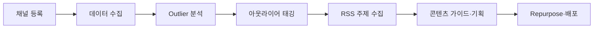

# Contents Dashboard — 사용 가이드

n8n 자동화와 대시보드 화면을 **언제·어디서·무엇을** 실행하는지 정리한 문서입니다.

**전제:** 로컬에서 `npm run dev`(대시보드)와 Docker n8n이 떠 있어야 합니다.

---

## 1. 최초 1회 세팅

### 1-1. Supabase SQL (순서대로)

[docs/migrations/README.md](../migrations/README.md) 참고.

| 순서 | 파일 | 필수 시점 |
|------|------|-----------|
| 최초 | `00-schema-full.sql` | 프로젝트 처음 |
| 추가 | `04-outlier-tags.sql` | Outlier 태깅 사용 전 |
| 추가 | `05-rss-topic-candidates.sql` | RSS 주제 수집 사용 전 |

### 1-2. 환경변수 (`.env.local`)

```env
N8N_WEBHOOK_YOUTUBE_COLLECT=http://localhost:5678/webhook/youtube-collect
N8N_WEBHOOK_OUTLIER_TAG=http://localhost:5678/webhook/outlier-tagging
N8N_WEBHOOK_RSS_TOPICS=http://localhost:5678/webhook/rss-topic-collect
```

### 1-3. n8n 워크플로 임포트

```bash
cd dashboard-app
./scripts/n8n-setup.sh
```

- n8n 컨테이너 기동 → 워크플로 3개 임포트·활성화 → Webhook 프로브
- 스크립트가 중간에 끊기면: `docker restart n8n` 후 n8n UI(`http://localhost:5678`)에서 워크플로 3개가 **Active** 인지 확인

### 1-4. 대시보드 실행

```bash
npm run dev
# → http://localhost:3000/dashboard
```

---

## 2. 일일·주간 작업 흐름 (권장 순서)

아래는 **YouTube 분석이 목적일 때**의典型 흐름입니다.



| 단계 | 타이밍 | 대시보드 메뉴 | 하는 일 |
|------|--------|---------------|---------|
| ① 채널 등록 | 최초·채널 추가 시 | **채널·콘텐츠 등록** (`benchmark`) | 경쟁·내 채널 YouTube ID 등록 |
| ② 내 채널 지정 | 운영 채널 정할 때 | **내 채널 → 운영 허브** (`channels-mine`) | «내 채널» 플래그 설정 |
| ③ 데이터 수집 | **하루 1~2회** 또는 채널 추가 직후 | **데이터 수집** (`data-collect`) | YouTube 통계·영상 DB 반영 |
| ④ 성과 확인 | 수집 직후 | **전체 개요** / **YouTube** | vs.Avg·티어 확인 |
| ⑤ Outlier 탐색 | 수집 후·기획 전 | **기획/인사이트 → Outlier 분석** (`outlier`) | 1.5x~5x 필터로 히트 영상 |
| ⑥ 아웃라이어 고정 | 기획·Repurpose 전 | **Outlier 분석** 또는 **워크플로 관리** | 3x+ **자동 태깅** |
| ⑦ RSS 주제 | **아침·기획 회의 전** | **콘텐츠 만들기 → 콘텐츠 가이드** (`content-guide`) | **RSS 주제 수집** |
| ⑧ 기획·초안 | 주제 확정 후 | **콘텐츠 가이드** → **콘텐츠 제작** | 체크리스트·초안 작성 |
| ⑨ 재가공·배포 | 영상 확정 후 | **Repurposing** / **배포 자동화** | 멀티 플랫폼 작업 (수동+시드) |

n8n **스케줄**이 켜져 있으면 ③·⑥·⑦은 자동으로도 돌아갑니다 (수집 6시간, 태깅 12시간, RSS 매일).

---

## 3. n8n 워크플로별 — 화면·기능·타이밍

### 3-1. YouTube 채널 데이터 수집

| 항목 | 내용 |
|------|------|
| **목적** | 등록된 YouTube 채널의 영상·조회수·vs.Avg를 Supabase에 저장 |
| **언제** | 채널 등록 직후, 이후 **6시간마다**(n8n 스케줄) 또는 **하루 1~2회** 수동 |
| **대시보드 위치** | **데이터 수집** (`?view=data-collect`) — «전체 채널 수집» |
| **워크플로 관리** | **n8n → 워크플로 관리** (`automation`) — «YouTube 채널 데이터 수집» **n8n 실행** |
| **선행 조건** | `benchmark`에서 YouTube 채널 등록, `YOUTUBE_API_KEY` 설정 |
| **다음 단계** | Outlier 분석, YouTube/내 YouTube 통계 화면 |

### 3-2. 아웃라이어 자동 태깅

| 항목 | 내용 |
|------|------|
| **목적** | vs.Avg **3배 이상** 영상을 `outlier_tags`에 저장 (히트 패턴 추출용) |
| **언제** | **데이터 수집 후**, 주간 기획·Repurpose 전 (12시간마다 자동 가능) |
| **대시보드 위치** | **Outlier 분석** (`?view=outlier`) — **「▶ 3x+ 자동 태깅」** |
| **워크플로 관리** | `automation` — «아웃라이어 자동 태깅» **서비스 실행** |
| **선행 조건** | ① 수집 완료, ② `04-outlier-tags.sql` 적용 |
| **활용** | «태깅만 보기» 필터, **Repurposing** 시드, 벤치마크 참고 |

### 3-3. RSS → 주제 후보 자동 수집

| 항목 | 내용 |
|------|------|
| **목적** | 뉴스 RSS에서 **시니어·재테크** 관련 기사를 골라 주제 후보 저장 |
| **언제** | **기획 전**(아침/주간 회의), 콘텐츠 달력 비우기 전 (매일 자동 가능) |
| **대시보드 위치** | **콘텐츠 만들기 → 콘텐츠 가이드** (`?view=content-guide`) — **「▶ RSS 주제 수집」** |
| **워크플로 관리** | `automation` — «RSS → 주제 후보 자동 수집» |
| **선행 조건** | `05-rss-topic-candidates.sql` 적용 |
| **활용** | 가이드 화면 주제 목록, 키워드·스크립트 가이드 페이로드 입력 |

---

## 4. 메뉴별 빠른 참조

### 분석·인사이트

| 메뉴 (`?view=`) | 데이터 | n8n 연동 |
|-----------------|--------|----------|
| `overview` | Supabase 요약 | 수집 결과 반영 |
| `youtube` / `youtube-shorts` / `youtube-longform` | 실데이터 | 수집 |
| `outlier` | vs.Avg 필터 + 태깅 | 아웃라이어 태깅 |
| `trending` | 규칙 기반 인사이트 API | (로드맵) |
| `ai-insight` | 규칙 기반 인사이트 API | (로드맵) |

### 채널·수집

| 메뉴 | 용도 |
|------|------|
| `benchmark` | 채널·레퍼런스 URL 등록 |
| `channels-mine` | 내 채널 지정 |
| `channels-competitor` | 경쟁 채널 목록 |
| `data-collect` | **수집 실행·로그** (핵심) |

### 제작·자동화

| 메뉴 | 용도 |
|------|------|
| `content-guide` | **RSS 주제** + 가이드 체크리스트 |
| `content-studio` | 제목·본문 초안 (브라우저 저장) |
| `repurpose` | Outlier 기반 재가공 시드 |
| `deploy` | 배포 일정 (워크스페이스) |
| `automation` | **n8n Webhook 실행·상태** (핵심) |
| `n8n-lv1` | 전체 자동화 로드맵(24항목) |

### n8n

| 접속 | URL |
|------|-----|
| 대시보드 경유 | http://localhost:3000/n8n (끝 `/` 금지) |
| 직접 | http://localhost:5678 |

---

## 5. 워크플로 관리 화면 사용법

**경로:** 사이드바 **n8n → 워크플로 관리** (`?view=automation`)

1. 상단 **현재 n8n 연동** — Webhook 3개 활성 여부(초록/노랑)
2. **로드맵별 연동 상태** 탭(트렌드·콘텐츠·배포·운영)
3. 카드별:
   - **구현됨** (초록) → **「▶ n8n 실행」**
   - **부분 구현** (노랑) → 대시보드 API 또는 미리보기
4. **자동화 로드맵 열기** → 1~3단계 전체 목록 (`n8n-lv1`)

---

## 6. 문제 해결

| 증상 | 확인 |
|------|------|
| Webhook 404 | `./scripts/n8n-setup.sh` → `docker restart n8n` |
| 태깅 저장 실패 | `04-outlier-tags.sql` 실행 여부 |
| RSS 저장 실패 | `05-rss-topic-candidates.sql` 실행 여부 |
| 수집 0건 | `benchmark`에 채널 등록·`YOUTUBE_API_KEY` |
| n8n 실행해도 더미만 | `.env.local` Webhook URL 3줄 확인 후 **dev 서버 재시작** |

---

## 7. 관련 문서

- [SUMMARY.md](../SUMMARY.md) — 진행 요약·전개 로드맵
- [n8n/README.md](../n8n/README.md) — 워크플로 JSON·Webhook
- [migrations/README.md](../migrations/README.md) — SQL 순서
