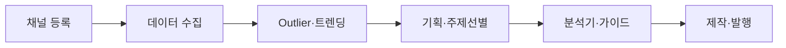

# Contents Dashboard — 사용 가이드

n8n 자동화와 대시보드 화면을 **언제·어디서·무엇을** 실행하는지 정리한 문서입니다.

**전제:** 로컬에서 `npm run dev`(대시보드)와 Docker n8n이 떠 있어야 합니다.

---

## 1. 최초 1회 세팅

### 1-1. Supabase SQL

[migrations/README.md](../migrations/README.md) 참고.

| 순서 | 파일 | 필수 시점 |
|------|------|-----------|
| 최초 | `00-schema-full.sql` | 프로젝트 처음 |
| 추가 | `04`, `05`, `11` 등 | 해당 기능 사용 전 |
| 확인 | `14`, `15` | 롱폼 vs.Avg·채널 스타일 |

### 1-2. 환경변수 (`.env.local`)

```env
NEXT_PUBLIC_SUPABASE_URL=…
SUPABASE_SERVICE_ROLE_KEY=…
YOUTUBE_API_KEY=…
DASHBOARD_API_SECRET=…

# n8n Webhook (예시)
N8N_WEBHOOK_YOUTUBE_COLLECT=http://localhost:5678/webhook/youtube-collect
N8N_WEBHOOK_OUTLIER_TAG=http://localhost:5678/webhook/outlier-tagging
N8N_WEBHOOK_RSS_TOPICS=http://localhost:5678/webhook/rss-topic-collect
N8N_WEBHOOK_LONGFORM_SCRIPT=http://localhost:5678/webhook/longform-script
N8N_WEBHOOK_AI_INSIGHTS=http://localhost:5678/webhook/ai-insights

# 콘텐츠 분석기 (Gemini 직접 호출)
GEMINI_API_KEY=…
DASHBOARD_GEMINI_DIRECT=1

```

점검: `npm run env:check`

### 1-3. n8n

```bash
cd dashboard-app
docker compose -f docker-compose.n8n.yml --env-file .env.local up -d
./scripts/n8n-setup.sh
```

### 1-4. 대시보드

```bash
npm run dev
# → http://localhost:3000/dashboard
```

---

## 2. 일일·주간 작업 흐름



| 단계 | 타이밍 | 메뉴 | 하는 일 |
|------|--------|------|---------|
| ① 채널 등록 | 최초 | `benchmark` | 분석 대상 채널 등록 |
| ② 내 채널 지정 | 운영 채널 정할 때 | `channels-mine` | «내 채널» 플래그 |
| ③ 데이터 수집 | 12h 자동 또는 수동 | `data-collect` | YouTube·블로그·티스토리 |
| ④ 성과 확인 | 수집 후 | `youtube-shorts` / `outlier` | vs.Avg·Tier |
| ⑤ 기획 | 기획 전 | `topic-suggest`, `ai-insight` | 주제·인사이트 |
| ⑥ 레퍼런스 분석 | (선택) | `content-analyzer` | URL → 감정·BGM·스토리 |
| ⑦ 초안 생성 | 주제 확정 후 | `content-guide` | AI 스크립트·Flow 블록 |
| ⑧ 제작 추적 | 영상 제작 중 | `production-tracker` | 6단계 진행·메모 |
| ⑨ 마감·변환 | 초안 후 | `content-studio` | 편집·포맷 변환 |
| ⑩ 발행 확장 | 완성 후 | `tiktok`, `instagram-*`, `blogger` | 멀티채널 가이드 |

n8n 스케줄(12h)이 켜져 있으면 ③·Outlier 태깅·RSS는 자동 실행 가능.

---

## 3. n8n 워크플로 요약

| # | Webhook | 화면 | 주기 |
|---|---------|------|------|
| W01 | `youtube-collect` | data-collect | 12h |
| W02 | `outlier-tagging` | outlier | 12h |
| W03 | `rss-topic-collect` | content-guide | 12h |
| W04~W05 | 네이버·티스토리 | naver-blog, tistory | 12h |
| W07 | `naver-blog-views` | naver-blog | 12h |
| W08 | `longform-script` | content-guide | 수동 |
| W09 | `topic-suggest` | topic-suggest | 수동 |
| W10 | `ai-insights` | ai-insight | 수동 |

상세: [n8n/README.md](../n8n/README.md) (W01~W10)

---

## 4. 워크플로 관리 화면

**경로:** `?view=automation`

1. Webhook 활성 여부 (W01~W10)
2. 로드맵별 연동 상태
3. 카드 **「▶ n8n 실행」** — Webhook 트리거

---

## 5. 문제 해결

| 증상 | 확인 |
|------|------|
| Webhook 404 | `./scripts/n8n-setup.sh` → `live-workflows.ts`와 경로 일치 확인 |
| 분석기 503 | `GEMINI_API_KEY` + `DASHBOARD_GEMINI_DIRECT=1` |
| Gemini MIME 오류 (YouTube) | 재생목록 URL — 영상 ID만 있는 URL 사용 |
| 수집 0건 | `benchmark` 채널·`YOUTUBE_API_KEY` |
| PC 꺼지면 수집 중단 | n8n 로컬 Docker — 클라우드 이전 검토 |
| `npm run build` 실패 | `tsconfig`에 `archive` exclude |

---

## 6. 관련 문서

- [SUMMARY.md](../SUMMARY.md) — 현황·우선순위
- [DASHBOARD_OVERVIEW.md](./DASHBOARD_OVERVIEW.md) — 화면·API 맵·콘텐츠 파이프라인
- [CONTENT_PRODUCTION_AZ_CHECKLIST.md](./CONTENT_PRODUCTION_AZ_CHECKLIST.md) — 콘텐츠 제작 A-Z 체크리스트
